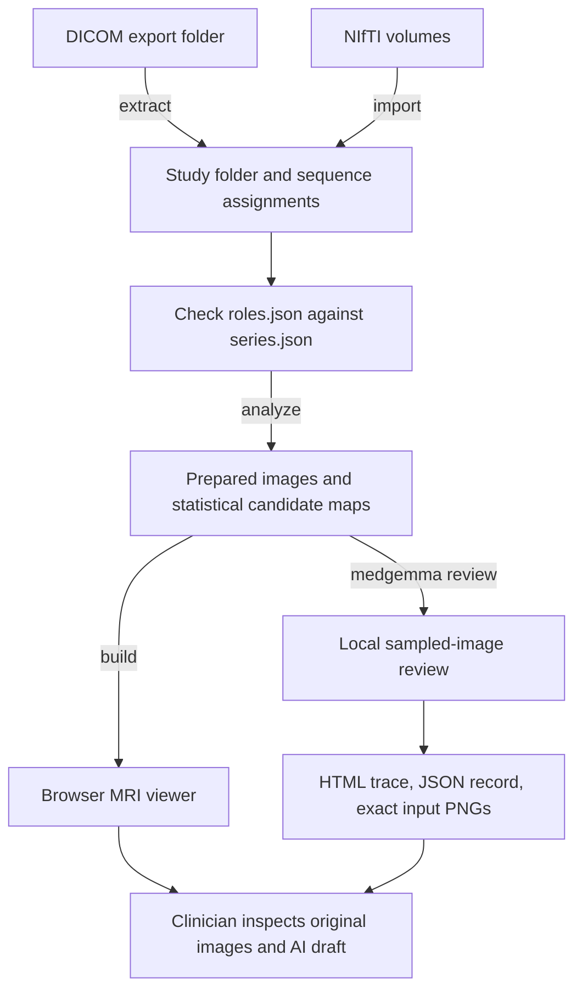

# mri-preread

A local brain MRI viewer and experimental AI review assistant for neurologists and radiologists.
Import a scan, inspect its sequences in a browser, and connect your chosen model through
[MCP](https://modelcontextprotocol.io). The model runtime can be local or institution-approved hosted
infrastructure. An optional MedGemma runner produces a research pre-read with exact images, prompts
and responses available for inspection; its current bundled backend is documented below.

The intended workflow is **scan → image preparation → visualization → AI draft → clinician review**.
The current MedGemma configuration is experimental: it flagged every sampled plane in our initial pilot.
It does not provide a validated diagnosis or automatically prioritize the clinical reading queue.

> **Not a medical device. Not a diagnosis.** The heterogeneity maps and the LLM pre-read point at places to
> look. They miss findings and they flag normal anatomy and artifacts. A qualified radiologist must review
> every scan.

## Hospitals, clinics and public source

Visit the [website and interactive public MRI demo](https://vallverdu.github.io/mri-preread/) or
[clone the repository](https://github.com/vallverdu/mri-preread).

Start with the [hospital integration guide](docs/hospital-integration.md) for pipeline commands, MCP
configuration, image-delivery integration and current gaps. The [hardware guide](docs/hardware-and-model.md)
explains model-host choices, the bundled backend and the limits of the tested laptop demonstration.

The [product website](site/index.html) includes an image-first interactive MRI header, a
[real public MRI viewer](site/demo/index.html) and
actual feature screenshots derived from CC0 OpenNeuro data. Original private studies and reports are
excluded from source. The deployment can use an owner-approved MRI poster and simplified volume
from a separate website-assets release, with explicit publication approval. Image-first background loading, an automatic front-to-back
cut and mouse-wheel depth control demonstrate volume interaction. To preview the public source:

```bash
git clone https://github.com/vallverdu/mri-preread.git
cd mri-preread
python3 -m http.server 8080 --bind 127.0.0.1 --directory site
```

Open `http://127.0.0.1:8080/`. The demo has the full viewer, measurement, clinician note and mask tools.
Example drawings are not clinical labels or AI predictions. See [dataset credits and reproduction](docs/open-demo.md)
and [third-party notices](THIRD_PARTY_NOTICES.md). Follow [public-release.md](docs/public-release.md) before
publishing source, and [CONTRIBUTING.md](CONTRIBUTING.md) to contribute. The MIT license covers the
application and generated consultation illustration; the tablet photograph uses the Unsplash License,
and model weights have separate terms. The
[website imagery documentation](docs/website-photos.md) records the AI prompts, composition references
and the unchanged public MRI captures used for feature close-ups.

**Anatomical scope:** the current preparation, brain masking, hemispheric asymmetry and candidate rules
are brain-specific. Other organs can have different geometry and normal asymmetry. This is not a
validated general-purpose MRI anomaly detector. The browser rendering components could be adapted,
but other anatomy requires a separately implemented and evaluated pipeline.

## Guide

- [Project tasks and completed milestones](TODO.md)
- [Hospital and imaging-center outreach plan](docs/outreach-plan.md)
- [Install and prepare the local model](#install)
- [From a scan to a viewable AI report](#from-a-scan-to-a-viewable-ai-report)
- [Viewer controls](#viewer)
- [How local MedGemma works](#local-medgemma-apple-silicon-experimental)
- [Automatic DICOM folder workflow](#automatic-local-review-worklist)
- [Troubleshooting](#troubleshooting)
- [Evaluation against reference lesions](#inspectable-pilot-against-expert-masks)
- [Optional MCP client integration](#llm-pre-read-mcp)

## What it does

- **Extract**: reads a DICOM export (CD, USB, PACS download), groups images by series, and writes NIfTI
  volumes with patient geometry. It can also write PNGs. It guesses which series is T1, FLAIR, T2, SWI, DWI and ADC.
  `import` builds a study from NIfTI files instead. Any subset of the six sequences works.
- **Analyze**:
  - Removes the skull (morphological).
  - Rigidly registers sequences to the selected reference (T1 when available), using mutual information
    and an automatic fallback to scanner coordinates when a registration drifts.
  - Corrects the intensity bias field (N4).
  - Computes two heterogeneity maps:
    - **Outliers**: a Gaussian-mixture model of this brain's own 6-channel intensities
      (T1, T2, FLAIR, SWI, DWI, ADC). Voxels whose combination fits none of its tissue classes score high.
    - **Asymmetry**: the brain is registered to its mirror image, and regions that differ from the other
      hemisphere, beyond the typical left/right difference, score high.
  - Clusters both maps into hotspots and labels them with simple rules, for example "DWI distortion artifact",
    "vein-like on SWI" or "fluid-like".
- **Viewer**: `brain_viewer.html` is self-contained and needs no server or libraries:
  - WebGL2 ray-marching with Surface, Volume and MIP modes.
  - Starts with the whole volume. Slice navigation or box sliders define cuts; cut faces show the selected sequence.
  - Linked axial, coronal and sagittal slices.
  - Heat-map overlays, visible in 3D and through the surface.
  - A ruler and a circular ROI with statistics on every sequence, exportable as CSV.
  - Clinician notes with 2D/3D point locations, manual voxel masks, brush/eraser, undo/redo and portable JSON.
  - The AI pre-read list, with numbered markers and inspectable input/response traces.
- **LLM pre-read (MCP)**: 16 tools let an LLM:
  - see slices, as crops and montages with coordinates
  - compare a region with the mirror side
  - review the algorithm's candidates
  - write prioritised "area to review" annotations

  The annotations show up live in the viewer at `http://127.0.0.1:8765/`. The LLM can move your crosshair and read
  where you are looking. The server's instructions forbid diagnoses and "normal" verdicts.

## Privacy

Everything runs locally. The code never uploads anything, with one exception: when you connect an LLM, the
rendered images go to that LLM's provider. The optional local MedGemma runner below keeps inference on your
Mac; only its separate model-download step needs internet access.

- A study folder, and the `brain_viewer.html` built from it, contain the full scan. A surface rendering of a
  3D T1 shows the face. Treat them like the original DICOM.
- `study.json` retains description, date, scanner, age and sex, but excludes patient name, ID and birth date.
  This is not a guarantee of anonymization: descriptions and dates can still identify someone. Worklist input
  snapshots retain the original DICOM files and their metadata.
- `.gitignore` excludes `data/`, DICOM, NIfTI, `.npz`, viewers and annotations, so a study inside the repo
  (for example `data/<study>/`) stays out of git. Keep it that way, and don't put patient screenshots in issues or PRs.

## Install

Run the commands below in a terminal **from the repository root**. Paths beginning with `data/` or `models/`
are relative to that directory. Replace `/path/to/...` with your own input locations; quote paths containing
spaces. Keep source exports and generated studies in separate folders.

The viewer and preprocessing require Python 3.10 or newer. The **local MedGemma runner additionally
requires an Apple Silicon Mac and Metal GPU access**; this repository does not currently provide a
CUDA, Windows, or CPU inference backend. Local inference has been exercised on an M5 MacBook Air with
16 GB unified memory. A separate GPU is not needed for that tested configuration.

After obtaining a checkout of this repository:

```bash
cd /path/to/mri-preread
python3 -m venv .venv
.venv/bin/python -m pip install -e .
```

For compressed DICOM exports, install the optional pixel decoders:

```bash
.venv/bin/python -m pip install -e ".[dicom-compressed]"
```

To enable local MedGemma, install its runtime, download the weights once, and check inference using a
synthetic image. The download uses the internet; the smoke test and MRI review use local weights.

```bash
.venv/bin/python -m pip install -e ".[medgemma]"
.venv/bin/mri-preread medgemma download
.venv/bin/mri-preread medgemma smoke-test
```

The default model is `mlx-community/medgemma-1.5-4b-it-4bit`, saved in
`models/medgemma-1.5-4b-it-4bit` (about 3.4 GB of weights). The smoke test asks the model to describe a
red square; it verifies that the runtime works, not that the model can interpret MRI correctly.
The download records its repository revision in `download-provenance.json`. Review runs reuse those
local weights; they do not download a new model. If you choose another storage location, pass the same
`--model-dir /path/to/model` to `download`, `smoke-test`, `review`, and `worklist`.

## From a scan to a viewable AI report

This walkthrough uses `data/my-study` as the generated study directory. There is no browser upload form:
provide a local DICOM folder or NIfTI files through the CLI, or use the [automatic watcher](#automatic-local-review-worklist).
You do not need lesion annotations or an expert report to run inference. You do need a reference to measure
whether its findings are correct.



### 1. Provide one scan

Choose **one** of these input routes.

**DICOM export.** Use an unzipped export folder containing one study. Nested series folders are allowed.
The extractor reads classic DICOM images with patient orientation and position; do not combine exports
from different patients or studies in a manual extraction. The automatic watcher additionally rejects mixed
studies and unsupported multi-frame images. This is not a general-purpose enhanced-MRI importer.

```bash
.venv/bin/mri-preread extract "/path/to/dicom-export" data/my-study
```

This creates NIfTI volumes, `series.json`, `study.json`, and an initial `roles.json`. Add `--png` if you also
want exported 8-bit slice images; these PNGs are optional and are not the default MedGemma inputs.
The source export remains in its original location.

**NIfTI volumes.** If the scan is already in `.nii` or `.nii.gz` format, import its sequences directly:

```bash
.venv/bin/mri-preread import data/my-study \
  --flair "/path/to/flair.nii.gz" \
  --dwi "/path/to/dwi.nii.gz" \
  --adc "/path/to/adc.nii.gz"
```

The supported roles are `t1`, `t2`, `flair`, `swi`, `dwi`, and `adc`. Supply only the sequences you actually
have; all files must belong to the same study and carry valid spatial geometry. An anatomical volume is
not a replacement for a missing ADC map. The import command creates the same study layout as extraction.

### 2. Verify which sequence is which

Open `data/my-study/series.json` and `data/my-study/roles.json` in your editor. DICOM roles are guesses from
series descriptions; verify them before processing. NIfTI roles come from the flags you supplied.

For example, if `series.json` lists `001_FLAIR`, `002_DWI`, and `003_ADC`, use:

```json
{
  "series": {
    "t1": null,
    "t2": null,
    "flair": "001_FLAIR",
    "swi": null,
    "dwi": "002_DWI",
    "adc": "003_ADC"
  },
  "register": {}
}
```

Use the **actual names in your own `series.json`**, without the `.nii.gz` suffix. Missing sequences should
be `null` or omitted. Any nonempty subset works technically, but available sequences constrain what can
be assessed. Check that diffusion images and ADC are not swapped, and that localizers or unintended
acquisitions have not been selected. For 4D inputs, the pipeline selects the DWI volume with
the lowest mean intensity as a high-b heuristic, and the first volume for other roles; this does not verify
the acquisition's b-values. Prefer a checked 3D volume when supplying multi-volume diffusion data.

Optional settings in the same JSON object:

| Setting | Effect |
|---|---|
| `"reference": "flair"` | Selects the reference grid. Otherwise the first available of T1, FLAIR, T2, SWI, DWI, ADC is used. |
| `"register": {"t2": false}` | Uses scanner coordinates for T2 instead of rigid registration. |
| `"register": {"t2": true}` | Forces retention of registration even if it exceeds the usual drift limit; inspect the alignment carefully. |
| `"skull_strip": "t1"` | Forces the pipeline's skull stripping when automatic detection would keep already-stripped input. Default: `"auto"`. |

ADC units are normalized automatically to ×10⁻⁶ mm²/s. These heuristics, role guesses, and registration
still need visual checking. Editing `roles.json` does not update existing analysis: rerun the following
steps after a correction, and generate a new AI report.

### 3. Prepare the images

```bash
.venv/bin/mri-preread analyze data/my-study
```

This is image processing, **not a MedGemma call**. It constructs the reference grid, performs skull
stripping and bias correction, aligns sequences, normalizes ADC units, and computes statistical outlier
and left/right asymmetry maps. It saves prepared volumes, metadata, and algorithmic candidates under
`data/my-study/analysis/`. Processing time depends on image size and registration; allow a few minutes.

Review the terminal messages and `analysis/meta.json` for available sequences and alignment results.
When registration is rejected, the pipeline can fall back to scanner coordinates; completion alone does
not establish correct alignment. Statistical candidate maps also do not establish a lesion diagnosis.

### 4. Build and inspect the viewer

```bash
.venv/bin/mri-preread build data/my-study
```

Open `data/my-study/brain_viewer.html` in a browser by double-clicking it. The HTML contains the scan and
works without a server. Use a browser with WebGL2 support. For optional local HTTP access, run this in a
second terminal and leave it running:

```bash
.venv/bin/python -m http.server 8798 --bind 127.0.0.1 --directory data/my-study
```

Then visit [the study viewer](http://127.0.0.1:8798/brain_viewer.html). This static server exposes files in
that study directory to local clients; stop it with **Ctrl+C** when finished.

Use **Four-up** or **Slices**, move through the brain with the slice scroll controls, and switch sequences
at the same crosshair position. Check image coverage, orientation, brain boundaries, and cross-sequence
alignment before reviewing AI output. The 3D rendering is a navigation aid; inspect the source slice
contrast as well. The [controls table](#viewer) below covers navigation and measurement.

The `all` command combines extraction, analysis, and viewer building, but bypasses the manual pause for
checking roles. Use the staged commands above for a new export protocol. `all` does not run MedGemma.

### 5. Run the local MedGemma pre-read

After model setup and image preparation, run:

```bash
.venv/bin/mri-preread medgemma review data/my-study \
  --step-mm 10 --max-tokens 128 \
  --output data/my-study/analysis/medgemma-review-01.json
```

Use a **new output name for every run**; the command refuses to overwrite an existing trace or image
folder. Omitting `--output` generates a timestamped name automatically. The output directory must
already exist. The terminal prints the HTML report path and progress such as `Slice 3/14`.

The runner starts its own read-only MCP session, obtains aligned images, and sends them to MedGemma
locally. You do not need to configure a separate chat client or start `serve`. By default it samples
axial planes roughly every 10 mm and sends all available sequences together for each plane. This is
sampled review, not an exhaustive 3D read. See [the input workflow](#local-medgemma-apple-silicon-experimental)
for image preparation and decoding details.

Useful options:

| Option | Purpose |
|---|---|
| `--sequences flair dwi adc` | Restrict inputs to these sequences; all requested roles must exist. Omit to use all available roles. |
| `--step-mm 5` | Sample more densely than the default 10 mm; increases work and still does not establish detection accuracy. Allowed range: 1–30 mm. |
| `--max-tokens 128` | Limit generated tokens per plane. CLI default is 256; this walkthrough and the watcher use 128. Truncation is recorded. |
| `--max-slices 2` | Short development check only. It limits the beginning of the sampling plan and must not be presented as a complete review. |
| `--model-dir /path/to/model` | Use weights downloaded to a different local directory. |

### 6. Open the report and inspect the evidence

For the explicit output name above, open:

```text
data/my-study/analysis/medgemma-review-01.html
```

With the optional static server from step 4 still running, visit
[the AI input/output report](http://127.0.0.1:8798/analysis/medgemma-review-01.html).
You can open it during inference; it refreshes every 15 seconds. Each plane shows the exact sequence
images, model decision, explanation, timing, and expandable prompt/raw response and geometry details.
The saved response is the model's generated explanation, not access to internal reasoning.

Check the report status and reviewed/planned slice counts first. `complete` means the requested run
finished; it does not mean the model is correct or the whole scan was inspected. A development limit
can produce a completed but deliberately partial run.

| Model label | Meaning within this research workflow |
|---|---|
| `yes` | The model flagged this sampled plane for review. It is not a confirmed lesion. |
| `no` | The model did not identify a focal finding in these supplied images. It does not clear the scan. |
| `uncertain` | The model expressed uncertainty. Human inspection is still required. |
| `invalid` | The response could not be parsed into the expected decision and observation. |

**Current quality result:** the tested setup returned `yes` for every plane in the pilot, sometimes while
its explanation said no abnormality was visible. Treat its statements as unverified research output.
Without an independent expert reference, a private-scan run has no measured accuracy score.

There are three different outputs: statistical maps, point annotations written by an MCP client, and
MedGemma's sampled-plane report. A successful `medgemma review` now rebuilds the viewer with a dedicated
**MedGemma review** group. Select an entry to navigate to that axial plane, see its explanation and exact
input images, and highlight the plane in the other views. Click an input thumbnail to enlarge it; **Esc**
closes the image. These reports do not supply lesion coordinates:
the viewer draws a plane indicator, not a lesion contour or invented point marker. Existing MCP annotations
are preserved separately.

Ordinary `build` automatically checks the newest `analysis/medgemma-review-*.json`. Incomplete or mismatched
reports are not attached. To attach a report saved elsewhere, including a report from a separate pilot directory, use:

```bash
.venv/bin/mri-preread build data/my-study \
  --medgemma-report /path/to/completed-report.json
```

The builder compares reference geometry and regenerates every supplied plane's input PNGs to verify their
SHA-256 hashes against the report. Explicitly attaching a mismatched report fails the build. The verified
images and model text are embedded in the standalone viewer. This adds build time and file size; it does
not rerun inference or validate the medical statements. Reload an already-open viewer to see the update.

### Files to keep together

```text
data/my-study/
  study.json                     retained study metadata
  series.json                    extracted/imported series inventory
  roles.json                     sequence assignments and processing settings
  nifti/                         source volumes for this study
  png/                           optional extraction PNGs (--png)
  analysis/
    meta.json                    sequence and alignment metadata
    viewer_data.npz              prepared viewer data
    findings.json                statistical candidates, not Gemma findings
    annotations.json             optional MCP-client annotations
    medgemma-review-01.json       complete machine-readable trace
    medgemma-review-01.html       human-readable trace
    medgemma-review-01.assets/    exact model input PNGs
    ...                          prepared volumes, maps and transforms
  brain_viewer.html              self-contained MRI viewer
```

Keep the report HTML, JSON, and `.assets/` directory together with their relative paths intact. The report
contains image hashes, model provenance, sampling information, prompts, responses, and decoding settings.
The viewer and reports contain medical data; keep them under ignored `data/` and out of commits.

## Viewer

### Clinician notes and segmentation

Open **Clinician annotations → New annotation** to create a doctor's annotation. Enter a title,
clinical note and optional author; text saves when you leave the field or click **Save note**.
Use **Place point** to locate the note on a 2D slice or the visible 3D surface. Clicking the annotation
in the list brings all slice views to its location. Clinician markers use `D1`, `D2`, etc., and remain
separate from MCP annotations and MedGemma's unverified flags.

Choose **Paint mask** and drag to segment a region, or **Erase mask** to correct it. The brush radius
is measured in millimetres and respects the reference image's voxel spacing. In a 2D view, painting
affects one reference slice; scrolling while a clinician tool is selected advances one reference slice.
In 3D, painting uses a spherical brush centred on the visible anatomical surface or cut face, so it can
include deeper voxels. Use the cut controls to reach an internal region and inspect the mask in all three
slice views. **Navigate** returns to normal 3D rotation; shift/right-drag pans while annotating.

The segmentation is a voxel mask shared by all views. The selected annotation appears orange and other
clinician annotations cyan. In 3D, masks are shown through anatomy and follow the current cut limits;
they are manual delineations, not model predictions. **Undo / Redo** covers notes, points, brush strokes,
imports and deletion, retaining up to 30 actions within a voxel-history memory budget. **Esc** cancels
the current stroke. Erasing one annotation preserves overlapping masks belonging to other annotations.

Edits save in IndexedDB in the current browser, keyed to the reference scan's content and physical
geometry. They are not sent to the MCP server, S3, or other website visitors, and they are not embedded
automatically in a rebuilt HTML file. Browser profiles, origins, and devices have separate workspaces;
clearing browser data removes local drafts. The status line reports whether saving succeeded. If another
tab changes the same scan, the viewer prevents an overwrite and asks you to export and reload.

**Export notes + masks (JSON)** creates a portable copy containing text, author, timestamps, voxel
locations, image affine, and losslessly encoded mask runs (`x + nx * (y + ny * z)`). **Import JSON**
adds annotations to the matching scan; mismatched geometry, malformed masks and duplicate annotation
IDs are rejected without replacing current work. This is the viewer's annotation format, not DICOM SEG
or a NIfTI export. Export before switching computers or sharing a review. The workspace supports up to
64 annotations and two million painted voxels across their masks. A browser save failure leaves editing
available but requires export to keep the work.

### Navigation and display

| | |
|---|---|
| Layout | toolbar: **3D + slices**, **Four-up**, **Slices**. Drag the divider to widen the slice column; double-click it to reset. |
| Controls | Click a left-panel group heading to expand/collapse it. Drag the panel's right edge to resize; double-click to reset. The panel has a styled scrollbar. |
| Slice order | Drag the **⠿ AXIAL / CORONAL / SAGITTAL** handles onto another slice view. Focus a handle and use arrow keys for keyboard reordering. Order, panel widths and collapsed groups persist in this browser. |
| 3D cuts | The initial volume is whole. With **Cut follows slice navigation**, click/drag or scroll a 2D view to cut at that view's plane. **Keep** chooses which side remains. Moving a cut slider switches to a manual box cut; **Reset cut** restores the whole volume. |
| MedGemma | Expand **MedGemma review**, choose a reviewed plane, and inspect its explanation, input images and raw response. Purple dashed indicators mark the selected plane, not a segmented abnormality. |
| Focus | **⤢** on a pane, double-click it, or keys <kbd>1</kbd> 3D, <kbd>2</kbd> axial, <kbd>3</kbd> coronal, <kbd>4</kbd> sagittal: maximize. <kbd>Esc</kbd> restores. |
| Full screen | <kbd>F</kbd> or **⛶ Full screen**. <kbd>P</kbd> or **☰ Panel** hides the control panel. |
| Links | `brain_viewer.html#layout=quad`, `#max=ax&panel=0` open the viewer straight into a layout. |
| 3D | drag to rotate, right/shift-drag to pan, scroll to zoom |
| Slices | click/drag to move the crosshair, scroll to step through slices |
| Measure | Ruler: drag in a slice, or click two points on the 3D surface. ROI: drag a circle. Export CSV. |

### Publish a standalone viewer

After building and checking a study, copy `brain_viewer.html` to your static website's project folder
as `index.html`. The volume data, annotations and any attached MedGemma review are embedded in that file;
the source DICOM directory and Python server are not required. The hosted page displays the saved review;
it does not run MedGemma inference. Live MCP annotation polling is enabled only on loopback hosts.

For S3 hosting, set the HTML object's `Content-Type` to `text/html; charset=utf-8`. If uploading a gzip
compressed copy, also set `Content-Encoding: gzip`, while keeping the object key `index.html`.
Add a cover image and link to the page from your site's project catalog. When replacing a cached catalog
or viewer, refresh its CloudFront cache entry. Verify the public URL loads and that the downloaded,
decompressed HTML matches your local build.

Publishing this file also publishes its embedded scan and model output: visitors can download them.
Choose the study and attached report with that visibility in mind.

## LLM pre-read (MCP)

Copy `.mcp.json.example` to `.mcp.json` and fill in the absolute paths (for Claude Code in this folder). For
another MCP client, add the same `command` / `args` entry to its config. Then:

1. Start the client and approve the `mri-preread` server.
2. Open http://127.0.0.1:8765/ (set `BRAIN_VIEWER_PORT` to change the port).
3. Ask, for example: *"Use the mri-preread tools to do an early pre-read and annotate the areas a radiologist
   should look at."*
4. Afterwards, `rebuild_standalone_viewer` (or `mri-preread build`) embeds the list in `brain_viewer.html`.

Tools: `get_study_overview`, `list_candidate_regions`, `view_region`, `view_overview`, `region_stats`,
`add_annotation`, `update_annotation`, `remove_annotation`, `list_annotations`, `clear_annotations`,
`set_summary`, `focus_viewer`, `get_viewer_state`, `rebuild_standalone_viewer`, `get_slice_plan`, `view_slice_images`.

## Local MedGemma (Apple Silicon, experimental)

Start with **MedGemma 1.5 4B**, using the
[MLX community 4-bit conversion](https://huggingface.co/mlx-community/medgemma-1.5-4b-it-4bit).
It runs on the Mac's built-in GPU using [MLX-VLM](https://github.com/Blaizzy/mlx-vlm).
The weights occupy about 3.4 GB. An M5 MacBook Air with 16 GB unified memory has run both the synthetic
test and an MRI/MCP trial successfully; a separate GPU is not needed for this starting point.

Why this model: [Google's MedGemma 1.5 model card](https://developers.google.com/health-ai-developer-foundations/medgemma/model-card)
explicitly adds CT/MRI volume support. Its internal MRI classification benchmark reports 64.7% macro
accuracy for 1.5 4B versus 57.4% for the older multimodal 27B. This does **not** establish accuracy on
our studies, our rendered montages, or quantized weights. The 27B text variant cannot interpret images.
Google also notes that MedGemma has not been optimized or evaluated for multi-turn applications.

Follow [installation](#install) and [the walkthrough](#from-a-scan-to-a-viewable-ai-report) for runnable commands.
The following describes what the default runner actually gives the model.

`review` requires an analyzed study and uses a **fixed, read-only MCP workflow**. It saves a separate
research report without changing viewer annotations. The default `slices` workflow:

- Samples the brain-mask extent every 10 mm (`--step-mm`, 1–30 mm). Selection never uses lesion masks,
  algorithmic candidates or previous annotations. Sampling can miss lesions between planes.
- Reads the float reference/registered NIfTIs through `view_slice_images`, avoiding the viewer's prior
  8-bit quantization. Applies a fixed window per volume (0–99.5th nonzero percentile; ADC 0–2400 ×10⁻⁶ mm²/s).
- Produces a separate 896×896 image for each sequence at the same reference plane, preserving physical
  aspect ratio with black padding. No mosaics, crosshairs, annotations or reference-mask overlays.
- Sends all available sequences together, in a documented order. `--sequences flair dwi adc` restricts
  the input. This is sampled axial review, not a full-volume or adjacent-slice interpretation.
- Requests a review decision and short visible evidence. The first output token is constrained to
  `yes`, `no` or `uncertain`, followed by a newline; the explanation is unconstrained. This makes labels
  parseable, **not calibrated or trustworthy**. The raw response, prompt, assistant prefix and decoding
  settings are recorded. Contradictions between the decision and explanation remain possible.

Each run writes `analysis/medgemma-review-<timestamp>.json`, a matching **HTML report**, and an `.assets/`
directory containing the exact input PNGs with SHA-256 hashes. Open the HTML to see every image, decision,
prompt and raw response. It refreshes every 15 seconds while a run is active. `--output /path/to/new.json`
selects a destination; existing reports/assets are refused. Preserve the HTML, JSON and image directory
together. These are patient data and belong outside git. Graceful failures/interruption retain completed
responses with a failure status; a killed process can leave `in_progress`.

`--max-tokens` bounds each response; a truncated explanation is marked explicitly. `--max-slices` is
for development smoke tests, not full evaluation. Use `--model-dir /absolute/path` outside the repository.
The runtime requires Metal access; run in a local Terminal if a sandbox cannot access the GPU.

The earlier montage workflow remains available with `--workflow montage --max-candidates 1`. Its images
can contain old annotation markers, so it should not be used for a blinded evaluation. The new slice
path removes this source of leakage. Neither workflow gives the model autonomous control of tools.

### Inspectable pilot against expert masks

This is a separate evaluation workflow, not a prerequisite for analyzing your own scan. It requires the
prepared and analyzed benchmark studies in `data/benchmark/` plus `data/benchmark/_key/key.json` and the
referenced expert masks. Those medical datasets are not included in a fresh checkout; the pilot command
does not download or prepare them. The existing benchmark preparation scripts are described in
[Evaluation](#evaluation-blinded-benchmark-40-cases). Use `--root /path/to/prepared-benchmark` for another
benchmark location. An optional private study must also have completed `analyze` first.

Choose a new output directory for inference:

```bash
.venv/bin/python eval/medgemma_pilot.py --out data/medgemma-pilot-new \
  --private-study data/my-study --step-mm 10 --max-tokens 128
# Optional local browser access (the reports also work as local files):
.venv/bin/python -m http.server 8799 --bind 127.0.0.1 --directory data/medgemma-pilot-new
```

The default pilot uses four ISLES mask cases (`case_02`–`case_05`) and two controls (`case_10`, `case_15`).
These were selected by source before inference; development case_01 is excluded. Model calls receive
images and a fixed question, not source labels, old findings or ground truth. After inference, predictions
and input image hashes are frozen in `FROZEN.json`. Only then does scoring load `_key/key.json`, align
expert masks using the saved DWI transform, and create orange reference overlays for human inspection.
Previous benchmark scores, frozen annotations and viewers are preserved.

Open `index.html` for metrics and links to every input/output trace; open `private.html` for the optional
private study. The private scan has **no accuracy score** because no expert reference mask is supplied.
`--score-only` verifies hashes and regenerates evaluation artifacts without rerunning inference.

Scores measure **flags on sampled planes containing stroke-mask pixels**, plus flags on planes without
labelled stroke. A positive anywhere on a lesion-containing plane counts, even if Gemma describes the
wrong location. They are not comparable with the previous point-within-10-mm benchmark below. Controls
have no masks and are reported separately as assumed negative. Uncertain/invalid responses are counted
explicitly, never silently treated as correct negatives. Slices from one patient are correlated; this
small pilot is not clinical validation or evidence of improved accuracy over the montage input.

**Initial pilot result (2026-09-27): this configuration failed to discriminate.** It selected `yes` on
all 91 sampled planes: 18/18 planes containing expert-mask lesions, 44/44 planes without labelled stroke
in the mask cases, and 29/29 control planes. Therefore the apparent 100% lesion-plane flag rate is not
useful detection. The constrained label sometimes contradicted the generated explanation. This result
applies to this quantized model, prompt and decoding setup; it does not establish MedGemma's performance
under other workflows. The remaining benchmark cases have not been used in this pilot.

Development checks on M5/16 GB: three-sequence inputs take roughly 4–5 seconds per plane and 4.7 GB
peak MLX allocation (not total system memory). Better inputs have not solved model reliability: report-style
responses can ignore instructions, and constrained decisions can over-flag or contradict their explanation.
Do not treat a flag as a confirmed finding, or a negative response as reassurance about the whole scan.

Your application code remains MIT licensed. MedGemma weights are governed separately by the
[Health AI Developer Foundations terms](https://developers.google.com/health-ai-developer-foundations/terms);
the community conversion does not make them MIT licensed. Weights and caches are excluded from git.

## Automatic local review worklist

Use this route to process successive DICOM exports without manually running each pipeline command.
Complete the [local model installation and smoke test](#install) first. The watcher uses the same
`analyze`, `build`, and `medgemma review` pipeline as the walkthrough, with 10 mm sampling and a 128-token
response limit. It does not require a separately running MCP client.

### Start the watcher

From the repository root, run the following and leave the terminal open:

```bash
.venv/bin/mri-preread worklist --inbox data/incoming-dicom --workspace data/worklist
```

Open [the local worklist](http://127.0.0.1:8800/). Put each study in its own immediate subfolder of
`data/incoming-dicom`. The exporter must create an empty `.ready` file **last**, after every DICOM file
has been written and closed. Without that marker the study stays waiting; a quiet folder is not considered
complete. This contract needs to be implemented by the export integration.

### Deliver a completed study

For example, arrange the inbox like this (the series directories can have other names):

```text
data/incoming-dicom/
  study-001/
    series-a/                      original DICOM files
    series-b/                      original DICOM files
    roles.json                     optional checked sequence mapping
    .ready                         create only after the export is complete
  study-002/                       still exporting; no .ready yet
```

To prepare a destination for an exporter:

```bash
mkdir -p data/incoming-dicom/study-001
```

Export or copy all DICOM files into that directory. Check that the export has finished and all files are
closed; then create the marker as a separate final action:

```bash
touch data/incoming-dicom/study-001/.ready
```

Do not create the marker at the beginning of a transfer. If correcting an export, remove its marker
first, finish the correction, then recreate the marker. Keep the inbox and workspace separate and
non-nested. Folder names are shown in the worklist; use neutral study labels if possible.

### Follow processing and review the draft

The worker checks that the folder contains one MR study, snapshots its inputs, then runs extraction,
image preparation, viewer generation, and local MedGemma review. It supports classic single-frame DICOM
with patient geometry; enhanced multi-frame MRI is rejected. An optional `roles.json` in the export folder
overrides sequence guesses, using the extracted series names (`001_FLAIR`, for example). Otherwise the
draft explicitly warns that sequence assignments need human verification.

The worklist links to the MRI viewer and the exact AI images, prompts, and outputs. It records durable job
states, processing failures, human priority, and review completion in SQLite. Identical exports are
deduplicated by content and DICOM instance IDs; changed images or sequence mappings create a new job.
Interrupted jobs become visible failures on restart and can be retried. Rejected exports must be corrected;
intake checks them again automatically. Processing logs and input snapshots live under the workspace.
Keep this workspace inside ignored `data/`, since snapshots retain the original DICOM metadata.

One local worker processes studies in receipt order. Intake is checked between jobs; the browser remains
available during processing. Human-assigned **Expedite** entries appear first in the displayed worklist.
**AI output never changes priority:** the current MedGemma setup failed the preliminary benchmark.
Every draft remains unverified and every study still requires clinical review. This is a single-operator,
loopback-only research prototype, without PACS integration, authenticated reviewer identities, or clinical
alerting. The export marker does not establish acquisition completeness or image quality.

The browser states distinguish workflow progress from clinical findings:

| Display/state | What to do |
|---|---|
| Waiting for export completion | Finish the export, then create `.ready`. No model run has started. |
| Queued | A completed export has been accepted and is waiting for the worker. |
| Processing | Check the displayed stage: extraction, image preparation, viewer building, or local AI review. |
| Draft ready | Open **MRI viewer** and **AI input/output trace**, inspect limitations, then perform human review. |
| Needs technical review / failed | Read the error and job log. Correct rejected exports, or use **Retry processing** after fixing a processing failure. |
| Reviewed | Someone used **Mark reviewed**. This records a workflow action, not validation of the AI findings. |

**Human priority** offers Unassigned, Routine, and Expedite. It affects the displayed order only;
processing remains in receipt order. No AI prediction sets this value.

Job artifacts are stored at `data/worklist/jobs/<job-id>/`: `processing.log` contains subprocess output,
`input-<timestamp>/` contains a source snapshot, and `study/` contains the viewer and analysis reports.
`data/worklist/worklist.sqlite3` stores job states and action events. Use the ID shown in the browser to
find the matching log. Preserve the workspace to retain history; avoid editing its generated study in
place. Correct source sequence mappings in the export and submit a completed version instead.

Stop the watcher with **Ctrl+C** and restart with the same command and workspace. Finished drafts remain
available, while jobs interrupted during processing become visible failures that can be retried. Only
one worker may own a workspace. This command is a foreground process, not an installed background service.

Use `--model-dir`, `--port`, or `--poll-seconds` to change defaults; `--once` processes the completed exports
currently discovered and exits. See the [clinician-assistant design and validation plan](docs/clinical-assistant.md)
for the path toward evidence-linked findings and validated queue assistance.

## Troubleshooting

| Symptom | Check / next action |
|---|---|
| `.venv/bin/mri-preread` does not exist | Run installation from the repository root and confirm the virtual environment was created there. |
| No DICOM images found | Unzip the export; point to the directory containing the actual image files. The extractor expects classic DICOM with a `DICM` preamble, pixel data, and patient geometry. PDFs/screenshots are not volumetric inputs. |
| Compressed pixel decoding fails | Install `".[dicom-compressed]"` in the same environment, then retry extraction. Unsupported transfer syntaxes may require another export format. |
| Wrong or missing sequences | Compare `roles.json` with `series.json`, correct the mappings, rerun `analyze` and `build`, and create a new MedGemma report. |
| Misaligned sequences or unexpected orientation | Inspect the slices and alignment metadata. A registration fallback is not proof of correct alignment; resolve the input/registration problem before interpreting cross-sequence output. |
| `Study has no viewer data` | Run `analyze` on the generated study directory, not the raw DICOM folder. |
| `Local weights missing` | Run `medgemma download`; use the same `--model-dir` for download and review. |
| Optional runtime missing | Install `".[medgemma]"` on an Apple Silicon Mac. Installing the extra on another platform does not add an alternative backend. |
| Metal/GPU unavailable in a sandbox | Run the command in a local Mac terminal with GPU access. The current runner does not fall back to CPU. |
| Memory pressure during inference | Close other large applications and avoid concurrent model runs. Fewer valid input sequences may reduce the workload but also reduce the evidence available. |
| `Output already exists` | Choose a fresh `--output` name or omit the option for a timestamped report. The old run is intentionally preserved. |
| Report images missing | Keep the HTML, JSON, and matching `.assets/` directory together; serve their common parent directory. |
| Report says `failed_or_interrupted` or stays `in_progress` after the process exits | It is incomplete. Inspect the terminal/job log and start a new run with a new output name. Completed responses may remain for inspection. |
| All planes say `yes`, or label and explanation disagree | This occurred in the recorded pilot. It is a model/workflow reliability failure, not evidence that every plane contains disease. |
| Worklist never receives a folder | It must be an immediate child of the configured inbox and contain a `.ready` file after export completion. Intake is checked between processing jobs. |
| Export rejected | Check for multiple Study UIDs, duplicate SOP instances, symlinks, non-MR images, or unsupported geometry/multi-frame DICOM. Correct the export and recreate `.ready`; intake checks it again. |
| Port already in use | Stop the conflicting server or choose another port: `worklist --port 8801`, or `http.server 8797`. MCP viewer ports use `BRAIN_VIEWER_PORT`. |

For command-specific flags, run `.venv/bin/mri-preread --help`,
`.venv/bin/mri-preread medgemma review --help`, or `.venv/bin/mri-preread worklist --help`.

## Limitations

- The 3D view is best with a thin-slice 3D T1 (or 3D FLAIR) as the reference.
- Thick-slice sequences (often 4-5 mm FLAIR, T2, DWI) are resampled to about 2 mm, so small lesions blur.
- Skull stripping is threshold and morphology based, not a trained model: it keeps the brainstem and upper
  cord, and can fail on unusual contrast. Already skull-stripped data is detected and used as is. [SynthStrip](https://surfer.nmr.mgh.harvard.edu/docs/synthstrip/)
  or [HD-BET](https://github.com/MIC-DKFZ/HD-BET) are more robust.
- Registration is rigid only. DWI inherits the ADC transform.
- The hotspot labels are simple rules, not validated classifiers. Nothing here has been clinically validated.
- The heterogeneity maps miss **large** lesions: a lesion covering much of a hemisphere becomes one of the
  mixture model's "normal" tissue classes, and the asymmetry map removes slow left/right trends (see Evaluation).
- DICOM extraction is tested on one GE 3T study. Other vendors' series naming may need a hand-written `roles.json`.

## Evaluation (blinded benchmark, 40 cases)

**Data.**
- 30 cases drawn at random (seed 20260928) from the [ISLES 2022](https://doi.org/10.5281/zenodo.7153326) stroke
  training set (CC BY 4.0). Each has FLAIR, DWI, ADC and an expert lesion mask.
- 10 healthy volunteers from [OpenNeuro ds007401](https://doi.org/10.18112/openneuro.ds007401.v1.0.0) (IDEAS II, CC0).
  Their ADC and b1000 DWI were computed from the multi-shell diffusion data. They were skull-stripped with this
  pipeline's T1 mask so that they look like ISLES data.
- Five volunteers were excluded and replaced by the next ones in the random draw: four have no DWI files on
  OpenNeuro, and one failed the quality gates.

**Blinding.**
- Every case got a neutral id and only FLAIR, DWI and ADC.
- 8 independent LLM readers (Claude, 5 cases each) worked only through the MCP tools (`eval/mcpcall.py`). They
  were told that some scans may be normal.
- An audit of all 503 tool calls found no access to the key, the masks or case files.
- The annotations were frozen (SHA-256) before scoring with `eval/score_benchmark.py`. A point counts as a hit
  within 10 mm of a lesion.
- To reproduce, run `eval/prepare_benchmark.py`, then `eval/analyze_all.py`, then the readers, then
  `eval/score_benchmark.py`.

| | LLM pre-read (high/medium items) | algorithm "review" candidates |
|---|---|---|
| stroke cases whose lesion was pointed at | **24 / 29** (83%, 95% CI 66-92%) | 20 / 29 (69%) |
| items that lie on a lesion (stroke cases) | **53 / 62** (85%, CI 75-92%) | 51 / 249 (21%) |
| healthy controls with any item | **0 / 10** (CI 0-28%) | 10 / 10 (11 candidates each) |
| lesion components ≥ 10 ml / 1-10 ml | 13 / 13 · 10 / 16 | |
| lesion components 0.1-1 ml / < 0.1 ml | 18 / 70 · 8 / 127 | |

- One ISLES case has an empty mask (no labelled lesion). It is left out of the stroke rows. The reader flagged two
  FLAIR white-matter areas in it.
- Four of the five missed stroke cases had lesions of 1.2 ml or less. The fifth (7.2 ml) was missed while the
  reader flagged FLAIR white-matter change elsewhere.
- Small lesions are the weak spot: most of the 226 lesion components are tiny satellite foci under 1 ml. On
  4-6 mm slices those often span one or two slices.
- The heterogeneity maps alone flag something in every scan, healthy ones included, and only about 1 in 5 of
  their candidates lies on a lesion. The value comes from the reader checking them visually, and from the
  systematic screening that also finds lesions the maps miss (for example very large ones).

**What this does not show.**
- Blinding is imperfect: the controls come from one other site and scanner, so a reader could partly tell them
  apart.
- There are only 10 controls (a 0/10 false-alarm rate still allows up to 28%), and all abnormal cases are acute
  strokes, which DWI shows well. Other diseases, subtle findings and contrast-enhanced studies are untested.
- The readers are the same model family that built the tool, and there is no radiologist comparison.
- Controls have no labels, so an incidental real finding would have counted as a false alarm.
- This is a feasibility check, not a clinical validation.
- An earlier 3-case pilot on ISLES found bugs that were fixed before this run: ADC units, the registration drift
  check, oblique voxel spacing, and skull stripping of defaced or loosely masked T1s.

## Related work

None of the building blocks is new. What this project adds is the combination: a dependency-free
multi-sequence viewer, classical anomaly candidates, and an MCP loop in which the LLM has to verify each candidate
visually and writes review areas live into the viewer the human is using.

- **Web volume rendering**: [NiiVue](https://github.com/niivue/niivue) (WebGL2, clip planes, overlays, the
  closest mature alternative), [MRIcroGL](https://github.com/rordenlab/MRIcroGL),
  [Will Usher's WebGL raycaster tutorial](https://www.willusher.io/webgl/2019/01/13/volume-rendering-with-webgl/),
  Papaya, OHIF, 3D Slicer.
- **Outliers of a multispectral tissue model**: Van Leemput et al., *IEEE TMI* 2001
  ([PubMed](https://pubmed.ncbi.nlm.nih.gov/11513020/)). Deep unsupervised anomaly detection is the modern
  alternative ([Baur et al. 2018](https://arxiv.org/abs/1806.04972)).
- **Hemispheric asymmetry**: e.g. [statistical asymmetry mapping](https://pubmed.ncbi.nlm.nih.gov/17946891/),
  [symmetry in lesion segmentation](https://arxiv.org/abs/1907.08196).
- **Medical imaging over MCP / LLM viewer agents**: [dicom-mcp](https://github.com/ChristianHinge/dicom-mcp)
  (PACS query), [mcp-slicer](https://github.com/zhaoyouj/mcp-slicer) (drives 3D Slicer), NiiVue-based MCP
  experiments, and recent research agents that operate viewers.

## License

[MIT](LICENSE) © 2026 Jordi Vallverdu. The software is provided "as is", without warranty of any kind. It is not
intended for clinical use.
