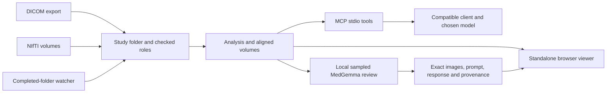

# Architecture and contributor reference

mri-preread is a brain MRI research viewer and assistant toolkit. For runnable workflows use
[README.md](../README.md); for institutional deployment boundaries use
[hospital-integration.md](hospital-integration.md). Patient data and local configuration belong outside
version control, except for the explicitly approved CC0 OpenNeuro MRI derivatives described in
[open-demo.md](open-demo.md). Synthetic regression fixtures remain under ignored `data/`.

## Components

| Component | Responsibility |
|---|---|
| `extract.py`, `study.py` | DICOM series extraction, NIfTI import, sequence roles and study folder layout |
| `analyze.py` | Brain-oriented masking, registration, intensity preparation, outlier and hemispheric asymmetry maps |
| `build_viewer.py` | Packs prepared arrays, metadata and selected report into one HTML file |
| `viewer_template.html` | WebGL2 volume rendering, linked axial/coronal/sagittal views, cuts, measurements and model trace UI |
| `annotation_core.js`, `clinician_viewer.js` | Manual notes, voxel masks, brush geometry, undo, IndexedDB and portable JSON |
| `mcp_server.py` | Per-study MCP stdio tools and loopback live-viewer endpoints |
| `slice_input.py` | Fixed-window, physically aligned clean sequence images for model input |
| `medgemma.py`, `medgemma_trace.py` | Optional Apple Silicon MLX inference and inspectable image/prompt/response records |
| `worklist.py`, `worklist_template.html` | Completed-export watcher, SQLite job states, technical warnings and human review controls |
| `eval/` | Blinded datasets, frozen predictions, reference-mask scoring and pilot traces |
| `examples/build_public_demo.py` | Pinned CC0 inputs, brain-masked public viewer and slice previews |
| `examples/build_synthetic_demo.py` | Reproducible ignored regression fixture |
| `scripts/` | Source audit, clean release export, static-site checks and packaging |
| `site/` | Hospital-facing product website, integration guide and real public MRI viewer |

## Data flow



The viewer performs rendering and clinician annotation in the browser. Python preparation and model
inference happen on a workstation. A hosted HTML does not contain a running Python or MedGemma service.
A local MCP client spawns `mri-preread serve STUDY` over stdio; the HTTP listener is a local viewer helper,
not a remotely authenticated MCP endpoint.

## Grids and geometry

Input images are converted toward canonical RAS orientation. The reference role is selected from
T1, FLAIR, T2, SWI, DWI and ADC, or explicitly in `roles.json`. The reference grid G1 defines locations
and the 3D surface. Non-reference sequences and statistical maps use G2, half the G1 resolution on each
axis. Reference preparation may crop/downsample and resample strongly oblique or anisotropic volumes.

- MCP locations, algorithmic findings and clinician mask voxels refer to G1, not the original DICOM indices.
- x increases toward patient right, y anterior, z superior; display follows radiological left/right order.
- Voxel spacing is the norm of each affine column, not its diagonal.
- Display millimetres are relative to the reference grid centre. Exported clinician JSON also includes
  the actual reference affine to support an explicit downstream conversion.
- Mild obliquity can be retained: inspect orientation and alignment before relying on measurements.
- ADC is normalized to ×10⁻⁶ mm²/s using magnitude heuristics that still need verification.

## Analysis boundaries

The morphology, tissue bands, left/right mirror comparison, outlier interpretation and candidate rules
are designed for the brain. A low asymmetry score is not a negative disease result. Normal anatomical
variation, motion, registration errors and partial volumes can cause high scores; symmetric or diffuse
changes can evade mirror comparison. The current analysis must not be described as validated for all MRI.

Registration uses rigid SimpleITK alignment and rejects excessive drift, falling back to scanner
coordinates. DWI can reuse the ADC transform. Bias correction precedes robust intensity scaling.
Outliers use an eight-component mixture of available sequence intensities. Asymmetry registers the
brain to its mirror, compares per-sequence intensities, removes slow trends and robustly scales the
residual. Candidates are clusters with heuristic tissue/artifact descriptions, not clinical labels.

## Annotation and report persistence

MCP annotations live in the study's `analysis/annotations.json`; they can be embedded by rebuilding.
Clinician annotations are separate browser drafts in IndexedDB, bound to reference-image content and
affine. Their JSON contains notes, points and lossless voxel-mask runs. Browser storage is not a hospital
record, authenticated authorship or central collaboration service. `author` is free text.

MedGemma's default review samples aligned axial planes. Each sequence is a separate 896×896 image;
all available selected sequences at the same plane are passed together. Original float NIfTI values
are windowed before input rendering. The model sees no clinician drawings, reference lesion mask or
statistical overlay in this workflow. Its output is text, not a lesion segmentation. An optional montage
workflow exists for comparison and is not the default.

Reports preserve prompts, raw responses, input hashes, decoding settings, model revision and timing.
The builder attaches a completed report only after regenerating and checking every input image against
the current study. This establishes input identity, not clinical correctness. Existing report files
are never overwritten by a review run.

## Study files and extension points

The study folder contains `study.json`, `series.json`, `roles.json`, extracted `nifti/`, optional `png/`,
prepared `analysis/` and a standalone `brain_viewer.html`. `study.json` retains description, date,
manufacturer/model, field strength, age and sex; omitting name/ID/birth date does not anonymize a scan.
Original DICOM snapshots retain their full metadata. `series.json` records series geometry and paths.

Use the actual extracted series names in `roles.json`. This is a schematic example:

```json
{
  "series": {"t1": "series_t1", "flair": "series_flair", "dwi": "series_dwi", "adc": "series_adc"},
  "reference": "t1",
  "register": {"flair": false},
  "skull_strip": "auto"
}
```

`register: false` keeps scanner coordinates; `true` bypasses the registration drift rejection. Both
need visual verification. `skull_strip: t1` forces the pipeline strip instead of automatic input detection.
Role guessing uses series descriptions and preferences for original images/axial 2D/larger 3D T1,
excluding FLAIR from T2, EADC from ADC and post-contrast T1. Check guesses against acquisition protocols.

| Prepared artifact | Grid and meaning |
|---|---|
| `ref_grid.nii.gz`, `brain_mask.nii.gz` | Float reference and mask on G1 |
| `<role>_in_ref_space.nii.gz` | Float other-sequence values on G2; ADC units normalized |
| `transform_<role>.tfm` | SimpleITK mapping from reference points into the source sequence |
| `outlier_score.nii.gz`, `asymmetry_score.nii.gz` | Float statistical maps on G2 |
| `meta.json` | Reference, grids, available roles, source descriptions and alignment warnings |
| `viewer_data.npz` | Reference uint8 on G1, other volumes/mask/maps on G2, reference spacing and scales |
| `findings.json` | Candidate G1 position, volume, peak, depth, class, description and contributing sequences |
| `annotations.json` | MCP summary and point annotations; never clinician browser drafts |
| `medgemma-review-*.json` / `.html` / `.assets/` | Immutable review trace and exact input PNGs |
| `reference_lesion.nii.gz` | Optional evaluation overlay; never read by the MCP image tools |

Viewer payload arrays use x-fastest order after a `(2, 1, 0)` transpose, gzip compression and base64.
The reference is scaled by its 99.8th percentile; other sequences use the 99.7th percentile within the
brain, with ADC fixed at 3200. Maps store score × 20, capped at uint8 range. Rendering is for inspection;
the model input path uses float images rather than this display quantization.

Clinician export uses `format: mri-preread-clinician`, `version: 1`, `study_id`, `dims`, `spacing_mm`,
`affine`, and voxel order `x + nx * (y + ny * z)`. Each item includes an ID, title, note, optional free-text
author, position, created/updated timestamps and `mask_runs: [[start, length], ...]`. The workspace limits
are 64 items and two million mask voxels. Imports validate study identity, affine, bounds, run overlap
and duplicate IDs atomically. Editing retains 30 undo actions subject to a voxel-cost bound. IndexedDB
revision checks prevent concurrent tabs silently overwriting one another.

The viewer's optional live link polls `/api/annotations` and `/api/focus` and posts `/api/viewer_state`
on loopback only. Set `BRAIN_VIEWER_PORT` for a separate study process. Model annotation `priority`
is a legacy research display field; it must not drive a clinical queue. The worklist's priority is set
explicitly by a human. Implement integrations against the code interfaces and retain these boundaries.

## Intake and scaling

The worklist expects immediate study subfolders and a `.ready` completion marker written last. It
checks study consistency and rejects unsupported multi-frame input, fingerprints exports, copies an
immutable processing snapshot and retains durable states in SQLite. A local lock prevents two workers
sharing the workspace. Processing is serial and receipt-ordered. Repeat changes create new fingerprints;
interrupted work recovers as a visible state. AI output never sets priority; human review actions are
explicit. The current lock uses `fcntl`, and the integrated inference uses Metal: run this watcher on
an Apple Silicon Mac.

There is no DICOM network receiver, DICOMweb client, PACS plug-in, FHIR/HL7 write-back, patient portal,
SSO, tenant isolation, centralized segmentation store or validated urgency detector in this release.
These are integration work, not switches already available in the CLI.

## Research and engineering roadmap

- Evaluate continuous first-token scores and localization against frozen independent reference masks;
  compare input sequences, adjacent-plane context and model/runtime variants separately.
- Report missed findings, false flags, exclusions and uncertainty across representative sites and protocols.
- Evaluate reader usefulness and time cost alongside accuracy; do not promote the pilot's all-positive output.
- Add verified DICOM SEG/NIfTI export, centralized annotation records and tested PACS/portal adapters.
- Test other vendors, transfer syntaxes, more robust optional brain masks and high-volume worker recovery.
- Implement and benchmark an accelerator-server backend before describing it as supported.

## Evaluation

See the [README evaluation sections](../README.md#evaluation-blinded-benchmark-40-cases) for the
separate point-based MCP feasibility benchmark and sampled-plane MedGemma pilot. The MedGemma setup
selected `yes` on all 91 sampled planes in six cases, including all 29 control planes. It failed to
discriminate. Those outputs must not drive clinical urgency. Benchmark outputs are ignored data;
public source includes evaluation scripts, not patients or frozen results. The source contains no
claim of clinical performance or certification.

## Development and release

```bash
.venv/bin/python -m unittest discover -s tests
node --test tests/test_*.cjs
.venv/bin/python examples/build_synthetic_demo.py
python3 scripts/check_site.py
python3 scripts/release_audit.py --history
```

The local development history previously contained identifying scan descriptions in documentation.
Use the audited clean snapshot described in [public-release.md](public-release.md) for the first public
repository. Preserve local history privately; do not attach it to the public export. Keep model weights,
local MCP config, private/raw scans, generated clinical viewers and exported notes out of Git. The
curated public dataset exception requires pinned source provenance and an intact derivative manifest.
