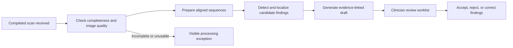

# Brain MRI review assistant

## Intended use

Prepare an initial, evidence-linked review of a completed brain MRI study for a neurologist or
neuroradiologist. Help the clinician find possible abnormalities sooner and, after condition-specific
validation, identify studies that may warrant earlier human inspection.

The product output is a review aid, not a final diagnosis or a declaration that a scan is normal.
Every study remains in the human reading workflow. A model's negative result does not cancel a review,
downgrade an existing urgent referral, or postpone the institution's usual care pathway.

## The workflow

A processing exception must remain visible in the worklist. It must not become a negative finding.
The original clinical queue remains authoritative while the assistant is being evaluated.

## What the clinician sees

This section describes the target product. The implemented `worklist` command currently provides
receipt time, durable processing state, technical warnings, viewer/AI trace links, human priority, and
review completion. Finding acceptance/correction, authenticated reviewer identity, automated quality
assessment, and validated AI urgency remain future work.

Each study has:

- Acquisition/receipt time, processing state, available sequences, and technical limitations.
- A compact list of candidate findings, each linked to the exact location in the viewer and supporting
  images across the relevant sequences. The list may be empty, but this is not a normal-scan verdict.
- An explanation of the observed signal pattern, relevant contrary evidence, and uncertainty.
- An explicitly separate proposed urgency, its evidence, and whether that detector has been validated
  for this acquisition/protocol. A language model's wording or token probability is not a calibrated risk.
- Human review state and controls to accept, reject, or correct a candidate. Human-assigned urgency
  and the original clinical urgency remain distinct from any AI suggestion.
- A record of model/version, inputs, processing steps, timing, and subsequent clinician changes.

The worklist initially orders studies by arrival time or the existing clinical priority. The current
MedGemma configuration must not supply an automatic urgency score or alter that order.

## Separate detection from explanation

Use the viewer and MCP as the common way to retrieve evidence and inspect locations. Treat the medical
language model as one component of the system, rather than the authority for detection, localization,
confidence, urgency, and reporting at once.

A detector should return structured evidence: finding category, spatial location or segmentation,
supporting sequences, quality/coverage checks, and a score only if that score has been calibrated.
MedGemma can then help express the evidence as a draft for the clinician. Its explanation must not
introduce unsupported locations, measurements, laterality, or urgency.

Start with a narrow imaging target for which there are reference labels. The available ISLES data
supports an initial research task involving ischemic-stroke lesions and DWI/ADC evidence. It does not
validate triage for hemorrhage, tumors, demyelination, or all neurological disease.

## Current evidence and constraints

The local pipeline already provides DICOM extraction, sequence mapping, registration, an MRI viewer,
MCP image access, local MedGemma inference, inspectable input/output traces, and expert-mask scoring.

The six-case MedGemma pilot selected `yes` for all 91 sampled planes, including all 29 control planes.
Some labels contradicted their explanations. This is a failure to discriminate for this configuration;
its outputs are not usable clinical priority signals. Clean input images and a parseable label do not
establish clinical accuracy.

The current slice-level pilot cannot show that the model localized a lesion. A flag anywhere on a
lesion-containing plane counts as a hit. Ten-millimetre sampling can also miss lesions between planes.
Before triage evaluation, predictions must identify a location and be checked across adjacent slices
and available sequences. Whole-study coverage and small-lesion performance must be measured separately.

Sequence role guesses, rejected registration, missing ADC, motion, incomplete coverage, and unsupported
protocols must be explicit inputs to the quality gate. The current role guesser has limited vendor testing;
unverified sequence assignments must not silently enter a clinical workflow.

## Initial automatic-processing milestone

Run locally in **shadow mode**: receive a completed export, process it, and create a draft worklist entry
without changing real clinical priority or sending clinical alerts.

Intake needs a positive completion signal from the export integration. A folder that has stopped growing
for a few seconds does not prove that all series have arrived. Check study identity so two patients or
studies cannot be combined accidentally; handle repeat exports and added series as explicit versions.

Jobs need durable states: received, waiting for completion, checking, processing, draft ready,
needs technical review, failed, and human reviewed. A restart must not lose a study, create duplicate
entries, or mistake an interrupted model run for a completed assessment. Keep processing failure and
clinical urgency separate.

The intake adapter can be a local export folder, a manual upload, or a PACS/scanner integration.
The worklist and processing job model should not depend on which adapter supplies a study.

## Evaluation before changing the human queue

1. **Detection/localization:** freeze outputs before exposing expert masks. Evaluate independent studies,
   component size, correct side/location, missed lesions, false findings per study, and abstentions.
   Include normal/negative cases and difficult artifacts; reserve cases not used for prompt development.
2. **Technical reliability:** test missing/mislabeled sequences, motion, incomplete exports, scanner/vendor
   variation, failed registration, interrupted jobs, and repeat exports. Measure time from scan completion
   to draft availability, not only model generation time.
3. **Reader usefulness:** have qualified readers assess whether candidate locations and explanations are
   correct and useful. Record review time, corrections, and whether the assistant causes inappropriate trust.
4. **Shadow triage:** obtain expert urgency labels independent of the model. Simulate or observe proposed
   queue changes without applying them. Measure urgent-case waiting time, delays introduced for other cases,
   missed urgent cases, and alert volume. Lesion-mask overlap alone does not establish urgency.
5. **Prospective use:** agree the intended use, target population, acceptance thresholds, escalation policy,
   and applicable clinical/regulatory requirements with the deploying clinical team before changing care.

The next model milestone is a detector and evidence policy that distinguishes positive from negative
studies and localizes findings. The local DICOM watcher now provides durable automatic intake and a visible,
human-controlled worklist. These components can be developed independently; successful automation does
not establish that the medical predictions are useful.

## References

- [FDA: radiological computer-assisted triage and notification software](https://www.accessdata.fda.gov/scripts/cdrh/cfdocs/cfPCD/classification.cfm?ID=QAS)
  describes imaging-based prioritization as a distinct intended-use category. This reference does not
  determine the regulatory classification of this project in a particular jurisdiction.
- [IMDRF: Software as a Medical Device — Clinical Evaluation](https://www.imdrf.org/sites/default/files/docs/imdrf/final/technical/imdrf-tech-170921-samd-n41-clinical-evaluation_1.pdf)
  separates clinical association, technical validation, and clinical validation.
- [FDA: Multi-QuCAD](https://cdrh-rst.fda.gov/multi-qucad-software-evaluate-wait-time-savings-and-delays-due-cadt-devices-multiple-diseases)
  addresses waiting-time benefits and delays introduced by imaging triage tools.
